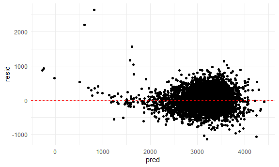
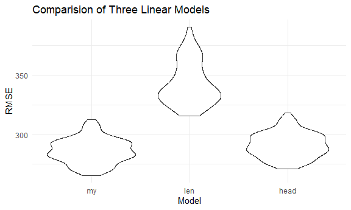
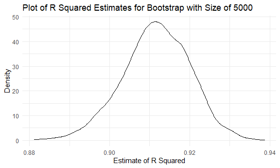
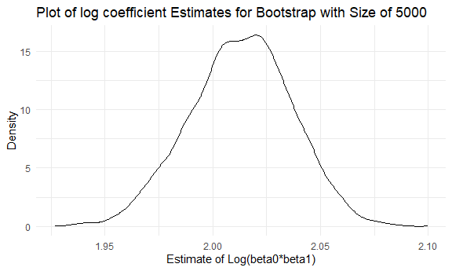

P8105-hw6-zc2556
================
Zhe Chen
2020/11/30

### Libraries and Basics

## Problem 1

``` r
#read in the dataset
homicide_df = 
  read_csv("./homicide-data.csv", na = c("", "NA", "Unknown")) %>% 
  mutate(
    city_state = str_c(city, state, sep = ", "),
    victim_age = as.numeric(victim_age),
    resolution = case_when(
      disposition == "Closed without arrest" ~ 0,
      disposition == "Open/No arrest"        ~ 0,
      disposition == "Closed by arrest"      ~ 1)
  ) %>% 
  filter(
    victim_race %in% c("White", "Black"),
    city_state != "Tulsa, AL") %>% 
  select(city_state, resolution, victim_age, victim_race, victim_sex)
```

    ## Parsed with column specification:
    ## cols(
    ##   uid = col_character(),
    ##   reported_date = col_double(),
    ##   victim_last = col_character(),
    ##   victim_first = col_character(),
    ##   victim_race = col_character(),
    ##   victim_age = col_double(),
    ##   victim_sex = col_character(),
    ##   city = col_character(),
    ##   state = col_character(),
    ##   lat = col_double(),
    ##   lon = col_double(),
    ##   disposition = col_character()
    ## )

Start with one city

``` r
baltimore_df =
  homicide_df %>% 
  filter(city_state == "Baltimore, MD")
#build the model
glm(resolution ~ victim_age + victim_race + victim_sex, 
    data = baltimore_df,
    family = binomial()) %>% 
  broom::tidy() %>% 
  mutate(
    OR = exp(estimate),
    CI_lower = exp(estimate - 1.96 * std.error),
    CI_upper = exp(estimate + 1.96 * std.error)
  ) %>% 
  select(term, OR, starts_with("CI")) %>% 
  knitr::kable(digits = 3)
```

| term              |    OR | CI\_lower | CI\_upper |
| :---------------- | ----: | --------: | --------: |
| (Intercept)       | 1.363 |     0.975 |     1.907 |
| victim\_age       | 0.993 |     0.987 |     1.000 |
| victim\_raceWhite | 2.320 |     1.648 |     3.268 |
| victim\_sexMale   | 0.426 |     0.325 |     0.558 |

Across cities

``` r
models_results_df = 
  homicide_df %>% 
  nest(data = -city_state) %>% 
  mutate(
    models = 
      map(.x = data, ~glm(resolution ~ victim_age + victim_race + victim_sex, data = .x, family = binomial())),
    results = map(models, broom::tidy)
  ) %>% 
  select(city_state, results) %>% 
  unnest(results) %>% 
  mutate(
    OR = exp(estimate),
    CI_lower = exp(estimate - 1.96 * std.error),
    CI_upper = exp(estimate + 1.96 * std.error)
  ) %>% 
  select(city_state, term, OR, starts_with("CI")) 
```

plot

``` r
models_results_df %>% 
  filter(term == "victim_sexMale") %>% 
  mutate(city_state = fct_reorder(city_state, OR)) %>% 
  ggplot(aes(x = city_state, y = OR)) + 
  geom_point() + 
  geom_errorbar(aes(ymin = CI_lower, ymax = CI_upper)) + 
  theme(axis.text.x = element_text(angle = 90, hjust = 1))
```


## Problem 2

### Import and clean the data

``` r
birthweight = 
  read_csv("./birthweight.csv") %>%
  drop_na() %>%
  mutate(
    babysex = as.factor(babysex),
    frace = as.factor(frace),
    malform = as.factor(malform),
    mrace = as.factor(mrace),
    parity = as.factor(parity)
  ) %>%
  #exclude variables with only one level
  select(
    -pnumlbw, -pnumsga
  )
```

While checking the data frame, we noticed there existed some plausible
values in the data set:

We have one 0 value in column “menarche”, representing the mother’s age
at menarche is 0. We could consider it as a missing value but since
there might be some special cases, we decided to keep it in our data
set.

Since we only have one value (0), in column “pnumlbw” and “pnumsga”, we
decided to exclude these two columns for the conveniance of constructing
model.

### Model building

``` r
#fit the regression model for birthweight
birthw_model = 
  lm(bwt~ fincome + babysex + bhead + blength + gaweeks, data = birthweight)
summary(birthw_model)
```

    ## 
    ## Call:
    ## lm(formula = bwt ~ fincome + babysex + bhead + blength + gaweeks, 
    ##     data = birthweight)
    ## 
    ## Residuals:
    ##      Min       1Q   Median       3Q      Max 
    ## -1134.38  -188.84   -12.25   180.79  2640.35 
    ## 
    ## Coefficients:
    ##               Estimate Std. Error t value Pr(>|t|)    
    ## (Intercept) -6233.2982    97.4212 -63.983  < 2e-16 ***
    ## fincome         1.2101     0.1675   7.225 5.88e-13 ***
    ## babysex2       34.0297     8.7882   3.872 0.000109 ***
    ## bhead         139.1403     3.5527  39.164  < 2e-16 ***
    ## blength        81.8178     2.0688  39.548  < 2e-16 ***
    ## gaweeks        13.3187     1.5078   8.833  < 2e-16 ***
    ## ---
    ## Signif. codes:  0 '***' 0.001 '**' 0.01 '*' 0.05 '.' 0.1 ' ' 1
    ## 
    ## Residual standard error: 284 on 4336 degrees of freedom
    ## Multiple R-squared:  0.6928, Adjusted R-squared:  0.6925 
    ## F-statistic:  1956 on 5 and 4336 DF,  p-value: < 2.2e-16

From the summary, we are quite confident for our model because both
R-squared and adjusted R-squared are high (\>0.5). Since variable
“wtgain” doesn’t effect the model building, terms are shown in “NA”.

``` r
birthw_model_result =
  birthw_model %>% 
    broom::tidy() %>% 
    select(term, estimate, p.value) %>%
    filter(p.value <= 0.05) %>%
    knitr::kable(digits = 3)

#make a tidy result
birthw_model_result
```

| term        |   estimate | p.value |
| :---------- | ---------: | ------: |
| (Intercept) | \-6233.298 |       0 |
| fincome     |      1.210 |       0 |
| babysex2    |     34.030 |       0 |
| bhead       |    139.140 |       0 |
| blength     |     81.818 |       0 |
| gaweeks     |     13.319 |       0 |

We made a tidy result including all statistical significant variables
and presented above.

### Plot

``` r
birthweight %>%
  modelr::add_residuals(birthw_model) %>%
  modelr::add_predictions(birthw_model) %>%
  ggplot(aes(x = pred, y = resid)) + 
  geom_point() +
  geom_abline(intercept = 0, slope = 0, linetype = "dashed", color = "red")
```



In general, from the residuals vs fitted plot, since the majority of
points bounces randomly above and below the reference line, we are quite
confident that the linear assumption is satisfied. However, we can spot
some outliers.

### Model Comparisions

build two other models

Model with length and mom age:

``` r
birthw_model_len_age =  
  lm(bwt~ blength + momage, data = birthweight)
summary(birthw_model_len_age)
```

    ## 
    ## Call:
    ## lm(formula = bwt ~ blength + momage, data = birthweight)
    ## 
    ## Residuals:
    ##     Min      1Q  Median      3Q     Max 
    ## -1773.5  -219.0    -7.4   212.6  4452.4 
    ## 
    ## Coefficients:
    ##              Estimate Std. Error t value Pr(>|t|)    
    ## (Intercept) -3989.313     96.509 -41.336  < 2e-16 ***
    ## blength       138.655      1.903  72.863  < 2e-16 ***
    ## momage         10.126      1.336   7.577  4.3e-14 ***
    ## ---
    ## Signif. codes:  0 '***' 0.001 '**' 0.01 '*' 0.05 '.' 0.1 ' ' 1
    ## 
    ## Residual standard error: 340.4 on 4339 degrees of freedom
    ## Multiple R-squared:  0.5586, Adjusted R-squared:  0.5584 
    ## F-statistic:  2745 on 2 and 4339 DF,  p-value: < 2.2e-16

Model with length, head circumference, gender and interaction:

``` r
birthw_model_head =
  lm(bwt~ blength + babysex + bhead + blength*babysex*bhead, data = birthweight)
summary(birthw_model_head)
```

    ## 
    ## Call:
    ## lm(formula = bwt ~ blength + babysex + bhead + blength * babysex * 
    ##     bhead, data = birthweight)
    ## 
    ## Residuals:
    ##      Min       1Q   Median       3Q      Max 
    ## -1132.99  -190.42   -10.33   178.63  2617.96 
    ## 
    ## Coefficients:
    ##                          Estimate Std. Error t value Pr(>|t|)    
    ## (Intercept)            -7176.8170  1264.8397  -5.674 1.49e-08 ***
    ## blength                  102.1269    26.2118   3.896 9.92e-05 ***
    ## babysex2                6374.8684  1677.7669   3.800 0.000147 ***
    ## bhead                    181.7956    38.0542   4.777 1.84e-06 ***
    ## blength:babysex2        -123.7729    35.1185  -3.524 0.000429 ***
    ## blength:bhead             -0.5536     0.7802  -0.710 0.478012    
    ## babysex2:bhead          -198.3932    51.0917  -3.883 0.000105 ***
    ## blength:babysex2:bhead     3.8781     1.0566   3.670 0.000245 ***
    ## ---
    ## Signif. codes:  0 '***' 0.001 '**' 0.01 '*' 0.05 '.' 0.1 ' ' 1
    ## 
    ## Residual standard error: 287.7 on 4334 degrees of freedom
    ## Multiple R-squared:  0.6849, Adjusted R-squared:  0.6844 
    ## F-statistic:  1346 on 7 and 4334 DF,  p-value: < 2.2e-16

Comparison:

``` r
#prepare trainning and testing data sets
cv_df =
  crossv_mc(birthweight, 100) %>% 
  mutate(
    train = map(train, as_tibble),
    test = map(test, as_tibble))
```

``` r
#calculate MSE
cv_df_test = 
  cv_df %>% 
  mutate(
    my_mod  = map(train, ~lm(bwt~ fincome + babysex + bhead + blength + gaweeks, data = .x)),
    len_mod = map(train, ~lm(bwt~ blength + momage, data = .x)),
    head_mod = map(train, ~lm(bwt~ blength + babysex + bhead + blength*babysex*bhead, data = .x))
    ) %>% 
  mutate(
    rmse_my = map2_dbl(my_mod, test, ~rmse(model = .x, data = .y)),
    rmse_len = map2_dbl(len_mod, test, ~rmse(model = .x, data = .y)),
    rmse_head = map2_dbl(head_mod, test, ~rmse(model = .x, data = .y))
    )
```

Plot

``` r
cv_df_test %>% 
  select(starts_with("rmse")) %>% 
  pivot_longer(
    everything(),
    names_to = "model", 
    values_to = "rmse",
    names_prefix = "rmse_") %>% 
  mutate(model = fct_inorder(model)) %>% 
  ggplot(aes(x = model, y = rmse)) + 
  geom_violin()+
  labs(
    title = "Comparision of Three Linear Models",
    x = "Model",
    y = "RMSE"
  ) + 
  
  theme(legend.position = "bottom")
```



We made a violin plot to compare the prediction error of three models.
My model has a low prediction error compared the other two models. Thus,
among these three models, my model (fincome, babysex, bhead, blength,
gaweeks) is the best.

## Problem 3

``` r
#include dataset 
weather_df = 
  rnoaa::meteo_pull_monitors(
    c("USW00094728"),
    var = c("PRCP", "TMIN", "TMAX"), 
    date_min = "2017-01-01",
    date_max = "2017-12-31") %>%
  mutate(
    name = recode(id, USW00094728 = "CentralPark_NY"),
    tmin = tmin / 10,
    tmax = tmax / 10) %>%
  select(name, id, everything())
```

    ## Registered S3 method overwritten by 'hoardr':
    ##   method           from
    ##   print.cache_info httr

    ## using cached file: C:\Users\Zhe Chen\AppData\Local\cache/R/noaa_ghcnd/USW00094728.dly

    ## date created (size, mb): 2020-12-01 14:47:55 (7.547)

    ## file min/max dates: 1869-01-01 / 2020-11-30

5000 for bootstrap

``` r
#function of bootstrap
boot_sample = function(df) {
  sample_frac(df, replace = TRUE)
}

#bootstrap for 5000
boot_straps = 
  data_frame(
    strap_number = 1:5000,
    strap_sample = rerun(5000, boot_sample(weather_df))
  )
```

    ## Warning: `data_frame()` is deprecated as of tibble 1.1.0.
    ## Please use `tibble()` instead.
    ## This warning is displayed once every 8 hours.
    ## Call `lifecycle::last_warnings()` to see where this warning was generated.

``` r
boot_straps
```

    ## # A tibble: 5,000 x 2
    ##    strap_number strap_sample      
    ##           <int> <list>            
    ##  1            1 <tibble [365 x 6]>
    ##  2            2 <tibble [365 x 6]>
    ##  3            3 <tibble [365 x 6]>
    ##  4            4 <tibble [365 x 6]>
    ##  5            5 <tibble [365 x 6]>
    ##  6            6 <tibble [365 x 6]>
    ##  7            7 <tibble [365 x 6]>
    ##  8            8 <tibble [365 x 6]>
    ##  9            9 <tibble [365 x 6]>
    ## 10           10 <tibble [365 x 6]>
    ## # ... with 4,990 more rows

Bootstrap and model building

``` r
#find rsquared
bootstrap_results = 
  boot_straps %>% 
  mutate(
    models = map(strap_sample, ~lm(tmax ~ tmin, data = .x) ),
    results = map(models, broom::glance)) %>% 
  select(-strap_sample, -models) %>%
  unnest(results) %>%
  select(
    strap_number, r.squared
  )
```

``` r
#find coefficient
bootstrap_results_coef = 
  boot_straps %>% 
  mutate(
    models = map(strap_sample, ~lm(tmax ~ tmin, data = .x) ),
    results = map(models, broom::tidy)) %>% 
  select(-strap_sample, -models) %>%
  unnest(results) %>%
  select(
    strap_number, term, estimate
  ) %>%
  pivot_wider(
    names_from = term,
    values_from = estimate
  )
```

``` r
#merge two dataset
bootstrap_results_all = 
  merge(bootstrap_results, bootstrap_results_coef, by = "strap_number")
bootstrap_results_all = 
  bootstrap_results_all %>%
  mutate(
    log_beta0_beta1 = log(bootstrap_results_all[,3]*tmin)
  ) %>%
  select(
    strap_number, r.squared, log_beta0_beta1
  )

head(bootstrap_results_all)
```

    ##   strap_number r.squared log_beta0_beta1
    ## 1            1 0.9029041        2.047502
    ## 2            2 0.9056891        2.041026
    ## 3            3 0.9076029        1.985898
    ## 4            4 0.9226853        1.947859
    ## 5            5 0.9199959        2.007668
    ## 6            6 0.9085084        2.012762

### Plot

``` r
bootstrap_results_all %>%
  ggplot(aes(x =  r.squared)) +
  geom_density() +
  labs(
    title = "Plot of R Squared Estimates for Bootstrap with Size of 5000",
    x = "Estimate of R Squared",
    y = "Density"
  ) + 
  theme(legend.position = "bottom")
```



``` r
bootstrap_results_all %>%
  ggplot(aes(x = log_beta0_beta1)) +
  geom_density() +
  labs(
    title = "Plot of log coefficient Estimates for Bootstrap with Size of 5000",
    x = "Estimate of Log(beta0*beta1)",
    y = "Density"
  ) + 
  theme(legend.position = "bottom")
```


We can observe a normal distribution for the both plots.

### find the CI

``` r
#tidy the data 
bootstrap_results_all %>%
  pivot_longer(
    r.squared:log_beta0_beta1,
    names_to = "term",
    values_to = "estimate"
  ) %>%
  group_by(term) %>% 
  summarize(
    ci_lower = quantile(estimate, 0.025), 
    ci_upper = quantile(estimate, 0.975))
```

    ## `summarise()` ungrouping output (override with `.groups` argument)

    ## # A tibble: 2 x 3
    ##   term            ci_lower ci_upper
    ##   <chr>              <dbl>    <dbl>
    ## 1 log_beta0_beta1    1.97     2.06 
    ## 2 r.squared          0.894    0.928
